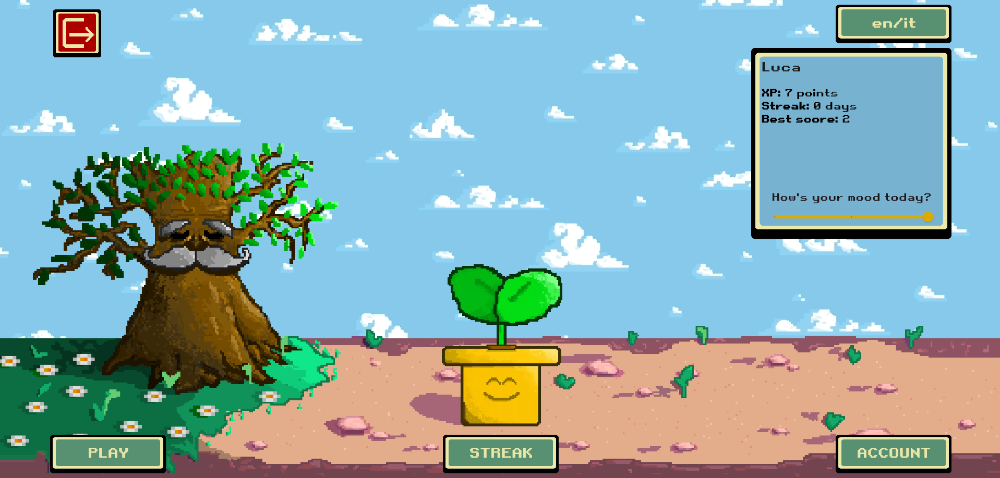
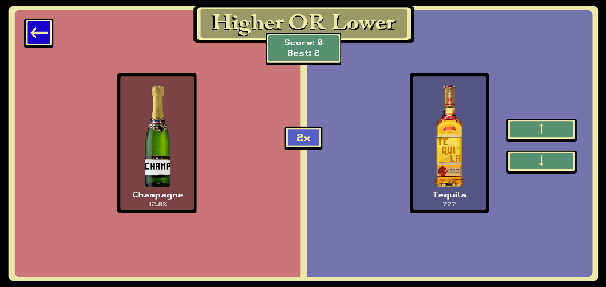
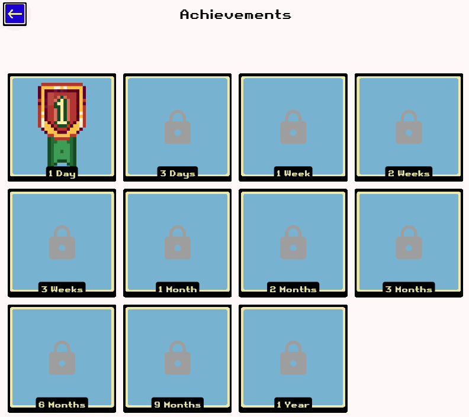

# **Bloom**
https://lucabte.github.io/

## 📑 Index
- [🌱 Introduction](#-introduction)
- [🎮 Description](#-description)
- [🛠️ Tools and Technologies](#-tools-and-technologies)
- [📦 Third‑party code/resources](#-third-party-coderesources)
- [📁 Outline of the file structure and dependencies](#-outline-of-the-file-structure-and-dependencies)
- [🛢️ Setting up online services and database](#-setting-up-online-services-and-database)
- [🚀 Build, Deploy, and Run](#-build-deploy-and-run)
- [📖 User Manual](#-user-manual)

## 🌱 **Introduction**
Bloom is an international project developed by a team of students from SUPSI-DTI in Lugano (CH) and managed by students from Penn State University (USA).\
The goal of the project is to give a gamified solution addressing SDG 3.5, which focuses on reducing the harmful use of alcohol.

## 🎮 **Description**
Bloom is a webapp developed with Flutter, so it can be used on all devices.\
**Key features:** Gamification, Progression Tracking, Education, Visual Progress.\
It features four main pages: Home, Game, Streak Account. (A detailed description of each page can be found in the [user manual section](#-user-manual)).\




## 🛠️ **Tools and Technologies**
- **Flutter**: The app is built using Flutter, a UI toolkit for building natively compiled applications for mobile, web, and desktop from a single codebase.
- **Appwrite**: Bloom uses Appwrite as a backend service for managing user authentication, data storage, and real-time updates.
- **GitHub**: The project is hosted on GitHub, allowing for version control and collaboration among team members.
- **Aseprite**: All the sprites used in Bloom are designed using Aseprite, a pixel art tool.
- **Lottie**: The animations used in the app are created using Lottie, a library for rendering animations in real-time.

## 📦 **Third-party code/resources**
The project does not directly use any third-party code. It relies only on Flutter's libraries. However, it was created starting from the project: https://github.com/appwrite/demo-todo-with-flutter. \
All visual assets used in the app were entirely designed by our team.
## 📁 **Outline of the file structure and dependencies**
As said before the project uses Flutter framework. All the required libraries and dependencies are listed in the [pubspec](pubspec.yaml) file.\
All the code is in the *lib* directory. This is its structure:
```
.
├── constants.dart
├── constants.dart.example
├── entities
│   ├── streak.dart
│   └── user.dart
├── l10n
│   ├── app_en.arb
│   └── app_it.arb
├── main.dart
├── routes
│   ├── account_page.dart
│   ├── Authentication
│   │   ├── LoginPage.dart
│   │   └── RegisterPage.dart
│   ├── Game
│   │   ├── Alcohol.dart
│   │   └── higher_or_lower.dart
│   ├── homepage.dart
│   └── StreakPage.dart
├── services
│   ├── appwrite.dart
│   ├── auth.dart
│   ├── CustomButton.dart
│   ├── GameService.dart
│   ├── localeProvider.dart
│   ├── MilestoneManager.dart
│   └── streak.dart
└── utilities.dart
```
**entities** contains the models used in the project. Those are classes used only to store the data and the behaviour of some components of the app.\
**l10n** contains the files with the translation of the app, both in English and in Italian.\
**routes** contains the actual widgets displayed in the app.\
**services** contains the code that manages the logic of various app behaviors.\
The app uses Appwrite for storing all the data.
## 🛢️ **Setting up online services and database**
In order to connect an external personal database to this project the [constants](/lib/constants.dart) file needs to be changed with the updated Appwrite database settings.\
The following Appwrite collections are used in the project:
- games
  - higherLower (Integer)
  - xp (Integer)
  - milestones (Integer[])
- streak
  - streak (Integer)
  - updated_at (Datetime)


### 🚀 Build, Deploy, and Run

Follow these steps to set up the environment, download the code, and run our project:

#### Prerequisites
Before starting, ensure you have the following installed on your system:
- [Flutter SDK](https://flutter.dev/docs/get-started/install) (version 3.0 or higher)
  - Follow the official guide to install Flutter for your operating system.
  - Add Flutter to your system's PATH to use the `flutter` command globally.
  - Run the following command to verify the installation:
    ```shell
    flutter doctor
    ```
    Ensure there are no errors in the output.
- [Appwrite](https://appwrite.io/docs/installation) (backend server)
  - Install Appwrite locally or on a cloud provider by following the [Appwrite installation guide](https://appwrite.io/docs/installation).
- [Git](https://git-scm.com/) (for version control)
- [Node.js](https://nodejs.org/) and npm (for managing Appwrite CLI)

#### Download the Project
1. Clone the repository from GitHub:
   ```shell
   git clone https://github.com/supsi-cs-student-projects/C4110Z.1-2025-Team-1
   cd C4110Z.1-2025-Team-1
   ```

#### Install Flutter Dependencies
2. Install the required Flutter dependencies:
   ```shell
   flutter pub get
   ```

#### Configure Appwrite
3. Set up the Appwrite backend:
- Start the Appwrite server by following the [Appwrite installation guide](https://appwrite.io/docs/installation).
- Create a new project in the Appwrite console with the ID `demo-todos`.
- Add Flutter platforms (Android/iOS) with the following IDs:
  - Android: `io.appwrite.demo_todo_with_flutter`
  - iOS: `io.appwrite.demoTodoWithFlutter`
- Deploy the required collections using the Appwrite CLI:
  ```shell
  appwrite deploy collections
  ```

4. Configure the project:
- Copy the file `lib/constants.dart.example` to `lib/constants.dart`.
- Update the file with your Appwrite endpoint and project ID.

#### Running the App
5. Run the app on your local machine:
   ```shell
   flutter run
   ```

## 📖 **User Manual**
The app is designed to be used by anyone who wants to track their alcohol consumption and reduce it.\
All you have to do is to open the link to the app (https://lucabte.github.io/) and register, or you can just enter as a guest to try it out.\
The app has 4 main pages:
- Home page:\
  This is the main page and has plenty of things, let's break them down:
  - The plant: it is the main character of the app. It grows with your XP points, and it changes according to your mood.
  - The CuriosiTree: it is a wise tree that gives you curious facts about alcohol. You can make it talk by clicking on it.\
  - The stats box: it shows your current statistics, which are:
    - Your XP points, collected by playing the game.
    - Your current streak, which is the number of consecutive days you have logged in the app and played at least one game. Progressing in days will unlock new special medals (shown in the 'Streak' page).
    - The best score made in the game 'Higher or Lower'.
    - A slider where you can set your current mood. Notice: your mood will affect the plant too!
  - Buttons:
    - 'Play' button: it will take you to the game page, where you can play the game 'Higher or Lower'.
    - 'Streak' button: it will take you to the streak page, where you can see all the medals you have unlocked.
    - 'Account' button: it will take you to the account page, where you can see your stats again and reset them.
    - 'en/it' button: it will change the language of the app.
    - The 'Logout' button: it will log you out of the app.
- Game page:\
  This page contains the game 'Higher or Lower'. The goal of the game is to guess if the alcohol on the right has a higher or lower percentage of alcohol than the one on the left.\
  You can play it by clicking on the buttons 'up' or 'down' on the right.\
  If you guess right, you will gain XP points, otherwise you will lose them.\
  You can also see your current score and the best score made in this game.\
  During the game you can get a '2x' button that will double your XP points for 10 seconds if you guess the question right.
- Streak page:\
  This page shows all the medals you have unlocked.\
  You can unlock a medal by playing the game for a certain number of days in a row.\
  Medals are:
  - 1 day
  - 3 days
  - 1 week
  - 2 weeks
  - 3 weeks
  - 1 month
  - 2 months
  - 3 months
  - 6 months
  - 9 months
  - 1 year
- Account page:\
  This page shows your current statistics and allows you to reset them.